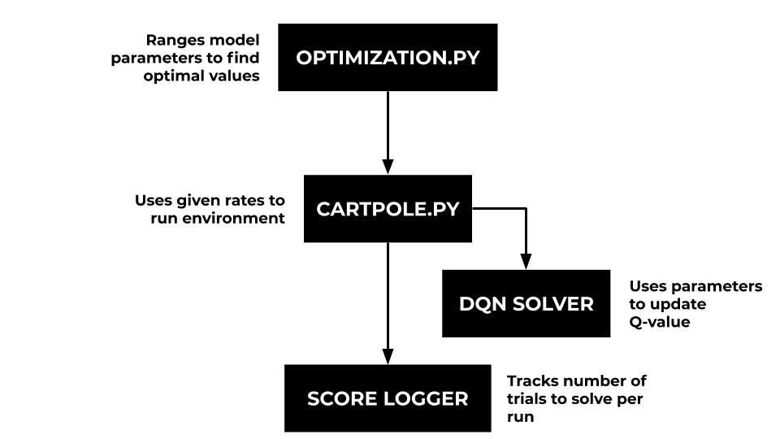
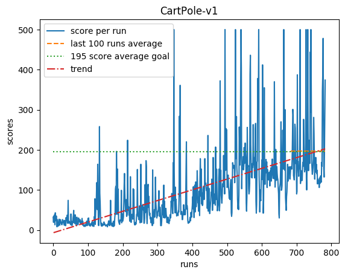
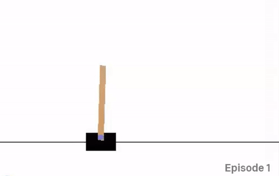
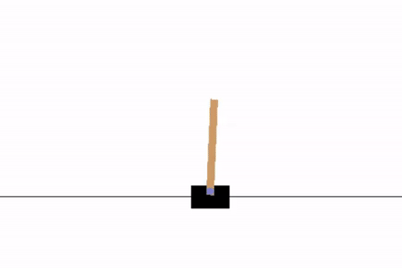

# Optimization of Mechanical Motion 
  Sander Miller and Dhara Patel 
  
  Franklin W. Olin College of Engineering, Machine Learning 
  
## Background 
In the world of robotics, precision is key. To achieve this order of precision, there are infinite parameters we need to optimize. Using reinforcement learning we can optimize a robot’s performance within minutes. Reinforcement learning uses experiences to learn first-hand what the best way of achieving a particular goal is. It assigns rewards to actions that lead to more optimal states. This model can be applied to many environments. Any robotic motion can use reinforcement learning to optimize. 

#### Our Environment: Inverted Pendulum

We used [OpenAi Gym’s ‘Carpole v1’ environment](https://gym.openai.com/envs/CartPole-v1/). It consists of an inverted pendulum mounted on a cart that can move left or right on a frictionless track. The system is controlled by applying a force of +/- 1 on the cart. The goal of the cart (agent) is to keep the pendulum upright for as many time steps as possible.

## Model Architechture 
A Deep Q-Network (DQN) is a reinforcement learning model that evaluates the benefit of a particular action given the current state and its future states.

A feedback loop allows it to learn a "pathway" that maximizes its reward. For every iteration, an agent (the cart) takes an action based on a model prediction and executes it on the environment. The environment then returns a reward for that action. This process is repeated until termination 

The Q-value, which is a cummulation of discounted future rewards, is what allows learning to happen. The Q-value allows the model to draw a optimized path to the goal by sampling experiences from the past. It depends on several parameters: gamma rate, learning rate, exploration decay rate. The gamma rate is a value from 0-1 that controls the impact of future reward on the current action. A gamma value closer to one more heavily weighs rewards in the future rather than just the current state.  The learning rate controls the rate at which newly aquired data overrides the previously known information. The exploration decay value controls the degree at which the model exploration rate decreases. The exploration rate is the likelihood of of the model to take a random action rather than the known best action. This stops the model from getting stuck at local maxima, paths that may produce a positive reward, but not the intended outcome.

We implemented our network in a class called *DQNNetwork* that keeps a memory of past experiences, calculates the Q-value, and takes an action given parameters. The *cartpole* function controls the environment and uses the *ScoreLogger* class to track the number of trials it took to keep the pendulum upright for 500 timesteps. The system diagram below depicts how our code is structured. 

### Optimization 
Our first iteration of our network used default parameter values. The graph below is the number of runs it took to *solve*, or reach an average reward of 195 over 100 consecutive trials for the default settings. 

We began optimizing by varying the gamma rate and measuring the number of trials it takes to solve. The graph below demonstrates that the optimial gamma rate is ... 

[insert gamma optimization here] 

The optimization class makes it easy to optimize multiple network parameters. We talk more about optimization in the Next Steps section.

## Results and Analysis

|:--:| 
| *Untrained Pendulum* |

|:--:| 
| *Applied DQN Pendulum* |

One of the main issues with reinforcement learning is the time it takes to train and have a functioning model. Because of this, it is very important to ensure the values the user has control over are optimized to minimize training speed and maximize 
We ran the model with all optimized parameters and were able to reach the solved state in __ trials. The graph below shows the number of steps for each trial before solve. 

Analysis here 

## Next Steps

Now that we have optimized our gamma parameter, we hope to be able to optimize the learning rate, and exploration decay values. Additionally we plan to test out alternative network structures, increasing the number of layers or optimizing other parameters could potentially improve the efficiency of our network. 
